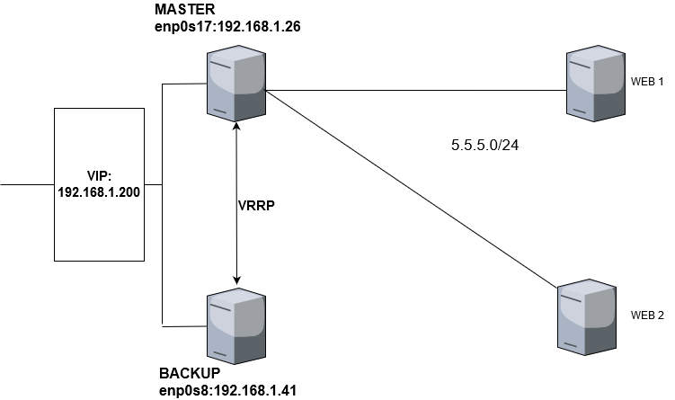
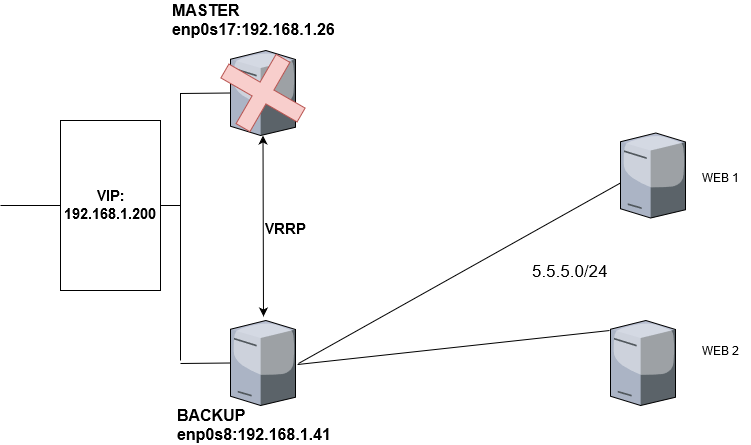
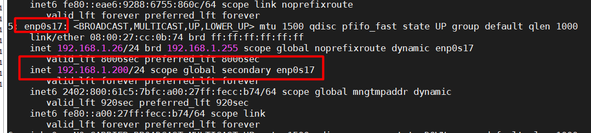

# CẤU HÌNH KEEP ALIVED CHO 2 NGINX LOAD BALANCER
## MÔ HÌNH : 
  

- Khi bị sự cố máy backup sẽ chạy 

  

 1. Cài keepalived
 Cài đặt trên cả 2 server centos chứa nginx load balancer.
 ```
 yum install -y gcc kernel-headers kernel-devel curl gcc openssl-devel libnl3-devel net-snmp-devel psmisc ipset-libs  

 yum install -y keepalived
 ```
 2. Cấu hình 
 Cấu hình cho card mạng gắn IP ảo và IP forward
 ```
 echo "net.ipv4.ip_nonlocal_bind = 1" >> /etc/sysctl.conf
 echo "net.ipv4.ip_forward = 1" >> /etc/sysctl.conf
 sysctl -p
```  

- Tắt selinux
- Cấu hình firewalld cho ca 2 server

```
iptables -I INPUT -i eth0 -d 224.0.0.0/8 -p vrrp -j ACCEPT
iptables -I INPUT -i eth0 -d 224.0.0.0/8 -p ah -j ACCEPT
iptables -I OUTPUT -o eth0 -s 224.0.0.0/8 -p vrrp -j ACCEPT
iptables -I OUTPUT -o eth0 -s 224.0.0.0/8 -p ah -j ACCEPT
firewall-cmd --direct --permanent --add-rule ipv4 filter INPUT 0 --in-interface enp0s3 --destination 224.0.0.18 --protocol vrrp -j ACCEPT;
firewall-cmd –reload;
``` 
Cấu hình Keepalived , một máy sẽ để làm master , còn máy còn lại để backup .
```
vrrp_script chk_nginx{
        #script '/usr/bin/killall -0 nginx';
        script "pidof nginx"
        interval 2
        #weight 4
        fall 3
        rise 2
}
vrrp_instance VI_1 {
    state BACKUP
    interface enp0s8
   # mcast_src_ip 192.168.1.41
    virtual_router_id 51
    priority 100
    advert_int 1
    authentication {
        auth_type PASS
        auth_pass 1111
    }
    virtual_ipaddress {
        192.168.1.200/24 dev enp0s8
    }
track_script {
        chk_nginx
   }
        nopreempt
        preempt_delay 300
}

```
- Khởi động keepalived :  
```
systemctl start keepalived
systemctl enable keepalived
```
3. Kiểm tra :
- Kiểm tra IP trên máy master :  

- Kiểm tra log của dịch vụ :   
```
tail -n 100 /var/log/messages
```

- Khi tắt máy master hoặc dừng dịch vụ nginx , VIP (virtual IP) sẽ được nhận bởi máy backup .


4. THAM KHẢO 
