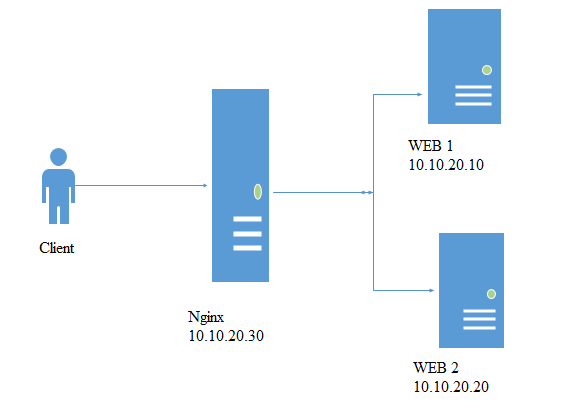

# CẤU HÌNH NGINX LOAD BALANCING  

  

2. Một số giải pháp.

    Cân bằng tải là một kỹ thuật thường dùng để tối ưu hóa việc sử dụng tài nguyên , tối đa hóa thông lượng , giảm độ trễ về đảm bảo tính chịu lỗi.

    Chúng ta có thể sử dụng nginx như là một bộ cân bằng tải để phân phối lưu lượng truy cập đến các máy chủ nhằm mục đích cải thiện hiệu năng , khả năng mở rộng và độ tin cậy của các ứng dụng web với nginx.

    Có rất nhiều thuật toán được xây dựng cho việc cân bằng tải, mỗi thuật toán đều có những ưu nhược điểm khác nhau, trong mỗi trường hợp sẽ có được tác dụng riêng, chúng ta cũng có thể kết hợp các thuật toán với nhau để giúp cho hệ thống của chúng ta hoạt động được tốt hơn. Tùy vào cơ sở hạ tầng và mục đích sử dụng thì chúng ta sẽ lựa chọn thuật toán phù hợp với hệ thống . Sau đây là một số thuật toán cân bằng tải.
  

2.1. Weighted load balancing:
  

Đây là một thuật toán quan trọng trong loadbalancing, khi sử dụng thuật toán này sẽ giúp chúng ta giải quyết đươc bài toán phân chia các server xử lý. Vói mặc định của nginx sử dụng thuật toán round-robin thì các request sẽ được chuyển luân phiên đến các server để xử lý, tuy nhiên đối với Weighted load balancing thì chúng ta sẽ phân ra được khối lượng xử lý giữa các server.

Ví dụ chúng ta có 2 server dùng để load balancing muốn cứ 5 request đến thì 4 dành cho server 1, 1 dành cho server 2 hay các trường hợp tương tự thì weighted load balancing là sự lựa chọn hợp lý.

Dưới đây là cách cấu hình chi tiết.

2.1.1. Trên các node apache :

Cài đặt apache :
```
yum install httpd httpd-devel
```

Khởi động apache :
``
systemctl start httpd
``

Truy cập thư mục /var/www/html
```
cd /var/www/html
```

Tạo file index.html
```
vi index.html
```

Thêm nội dung vào file index.html :
```
    ################### WEB 1 (2) #################
```
2.1.2. Trên node nginx.

Thêm repo nginx:
```
yum install epel-release
```
Cài đặt nginx :
```
yum install nginx
```
Khởi động nginx :
```
systemctl start nginx
```
Khởi động firewall-cmd :
```
systemctl start firewalld
systemctl enable firewalld
```
Cấu hình firewall và restart lại dịch vụ:
```
sudo firewall-cmd --permanent --zone=public --add-service=http 
sudo firewall-cmd --permanent --zone=public --add-service=https
sudo firewall-cmd --reload
```
Truy cập vào địa chỉ để kiểm tra :  


Dùng trình soạn thảo vi mở file /etc/nginx/nginx.conf
```    
    vi /etc/nginx/nginx.conf 
```
Sửa lại cấu hình như sau :

Tại block http thêm các cấu hình :
```
http {

    upstream backends {
        server 10.10.20.10:80 weight=3;
        server 10.10.20.20:80 weight=2;

# Cấu hình trên có nghĩa là cứ 5 request gửi tới server sẽ có 3 request vào web 1 và 2 request vào web 2.
    }
```


Tại block server thêm hoặc sửa các cấu hình thành như sau :
```
        server {

            listen      80 default_server;
            listen      [::]:80 default_server;
            server_name _;

            proxy_redirect           off;
            proxy_set_header         X-Real-IP $remote_addr;
            proxy_set_header         X-Forwarded-For $proxy_add_x_forwarded_for;
            proxy_set_header         Host $http_host;

            location / {
                proxy_pass http://backends;
            }
```
Restart lại nginx :
```
    systemctl restart nginx 
```
2.1.3. Kiểm tra .

Truy cập vào địa chỉ nginx web : http://10.10.20.30

